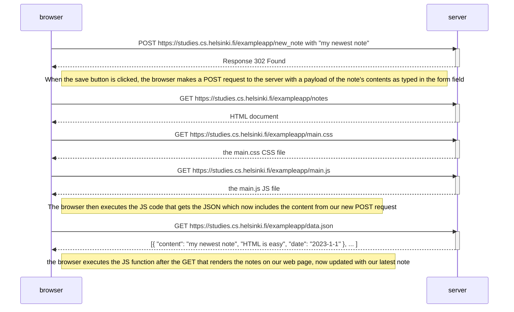

```mermaid
sequenceDiagram
participant browser
participant server

    browser->>server: POST https://studies.cs.helsinki.fi/exampleapp/new_note with "my newest note"
    activate server
    server-->>browser: Response 302 Found
    deactivate server

    Note right of browser: When the save button is clicked, the browser makes a POST request to the server with a payload of the note's contents as typed in the form field

    browser->>server: GET https://studies.cs.helsinki.fi/exampleapp/notes
    activate server
    server-->>browser: HTML document
    deactivate server

    browser->>server: GET https://studies.cs.helsinki.fi/exampleapp/main.css
    activate server
    server-->>browser: the main.css CSS file
    deactivate server

    browser->>server: GET https://studies.cs.helsinki.fi/exampleapp/main.js
    activate server
    server-->>browser: the main.js JS file
    deactivate server

    Note right of browser: The browser then executes the JS code that gets the JSON which now includes the content from our new POST request

    browser->>server: GET https://studies.cs.helsinki.fi/exampleapp/data.json
    activate server
    server-->>browser: [{ "content": "my newest note", "HTML is easy", "date": "2023-1-1" }, ... ]
    deactivate server

    Note right of browser: the browser executes the JS function after the GET that renders the notes on our web page, now updated with our latest note
```
