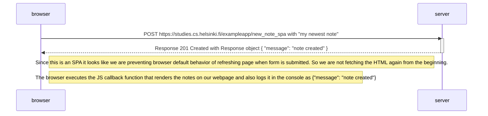

```mermaid
sequenceDiagram
    participant browser
    participant server

    browser->>server: POST https://studies.cs.helsinki.fi/exampleapp/new_note_spa with "my newest note"
    activate server
    server-->>browser: Response 201 Created with Response object { "message": "note created" }
    deactivate server

    Note right of browser: Since this is an SPA it looks like we are preventing browser default behavior of refreshing page when form is submitted. So we are not fetching the HTML again from the beginning.

    Note right of browser: The browser executes the JS callback function that renders the notes on our webpage and also logs it in the console as {"message": "note created"}
```
